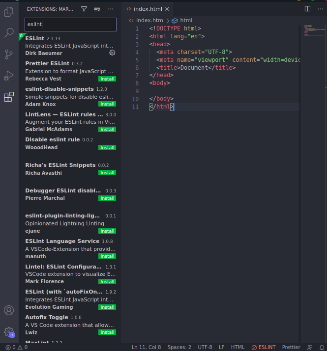

# starter-app

This is an html start project that comes scaffolded with Linting and Formatting by ESLint and Prettier.

It is meant to be a jump-start for students learning html, css, and javascript. Helping them to focus on fundamentals, without having to concern themselves with formatting their code.

## Install Node Dependencies

[Install Node](https://nodejs.org/en/download/)

After installing, close all terminals and vscode before proceeding.

```sh
# Open the terminal to your project cd path/to/my/project/folder (or Right Click and open Terminal here)
# Init this project as a node project
# `-y` skips prompts and accepts all defaults
npm init -y

# Install eslint and prettier as dev dependencies
npm install --save-dev eslint prettier
```

# Install VSCode plugins

Install and Enable [ESLint](https://marketplace.visualstudio.com/items?itemName=dbaeumer.vscode-eslint) and [Prettier](https://marketplace.visualstudio.com/items?itemName=esbenp.prettier-vscode) Plugins in vscode.

In VSCode, open the Extensions Pane (CTRL + SHIFT + X). Search for and install the two plugins.



CTRL + SHIFT + P > "Reload Window" to restart VSCode

# Configuration Files

> Below are three files important to configuration of vscode, eslint, and prettier. They shuold be installed to the paths described or they will not work. You may also refer to their locations in this project as a reference.

## .vscode/settings.json

This file tells vscode how to manage specific file types. It goes in the .vscode folder in a file named settings.json.

## .eslintrc.json

This file tells eslint how to behave. It goes in the root of your project.

## .prettierrc.json

This file tells prettier how to behave. It goes in the root of your project.